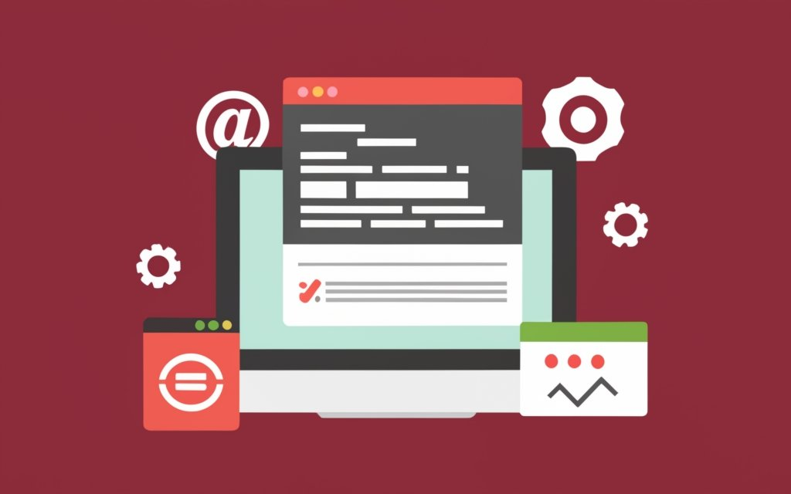

# Reset CSS PRO

Reset CSS Pro es el reset de **Eduardo Fierro** y el cual solventa varios problemas con los que me encuentro a la hora de maquetar, problemas como:

-   Unificar el uso de Custom Properties
-   Problemas de box-model más generales
-   Problemas con imagenes, vídeos e iconos svg
-   Problemas con tipografías y etiquetas input en formularios
-   Unificar la tipografía de todas las etiquetas de una web

## ¿Qué problemas resuelve?

-   Definición básica de Custom properties con tipografías y colores
    -   _Opcional_ Custom Properties en modo oscuro
    -   _Opcional_ Configuramos si un usuario ha activado el modo alto contraste _(WD)_
-   Reset de margin, paddings y border de todas las etiquetas
-   Evitamos problemas con las imagenes con recomendaciones de Microsoft
    -   _Opcional_ object-fit: cover;
    -   _Opcional_ object-position: center center;
-   Reset para las anclas que funcionen como cajas excepto los que se encuentran en párrafos
    -   _Opcional_ Configuramos anclas suaves
-   Quitamos los puntos de los <li>
-   Desactivamos estilos por defecto de las principales etiquetas de texto
-   Evitamos problemas con los pseudoelementos de _quotes_
-   Configuramos el selection de una web en base al color principal
-   Reset de los problemas tipográficos y la colocación de elementos de formularios
    -   _Opcional_ appearance: none;
-   Reseteamos las tablas
-   Evitamos problemas con los SVG
-   Configuramos la tipografía para toda la web
    -   _Opcional_ Configuración de interlineado
    -   _Opcional_ Problemas con palabras largas gracias a hyphens
    -   _Opcional_ Tipografía más suave en macOS gracias a font-smooth

## Instalación por npm _(Próximamente)_

En un próximo directo desde Twitch lo publicaremos en NPM para poder usarlo en cualquier proyecto.

## 📥 Descarga el PDF con todos los módulos

Aquí te dejo [un enlace de descarga hacia un PDF](https://eduardofierro.pro/descargas/modulos-de-una-web.pdf?utm_source=modulos-web&utm_medium=github&utm_campaign=descarga-pdf) con el resto de módulos, resumen y teoría.

## 🔴 Vídeos relacionados con el reset

| Nombre            | Youtube                                                                                                                                                               |
| ----------------- | --------------------------------------------------------------------------------------------------------------------------------------------------------------------- |
| Reset CSS: Teoría |  |
| Reset PRO: Código |  |
| Nomenclaturas CSS |  |
| Metodologías CSS  |  |
| Arquitecturas CSS |  |
